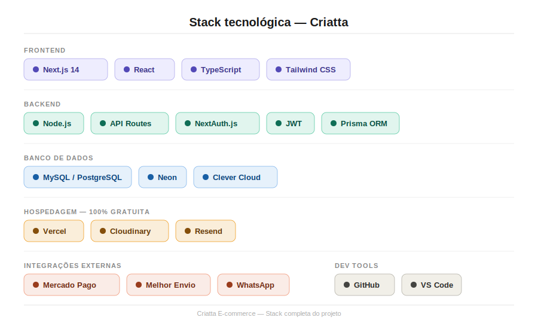
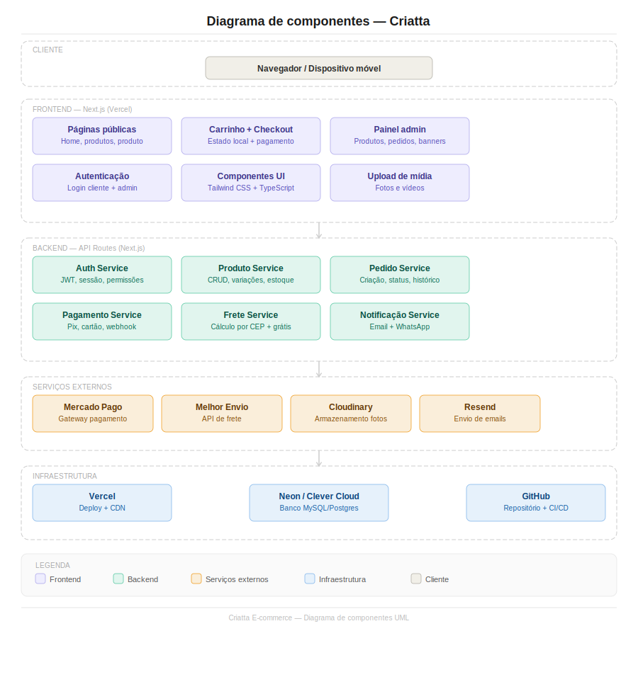
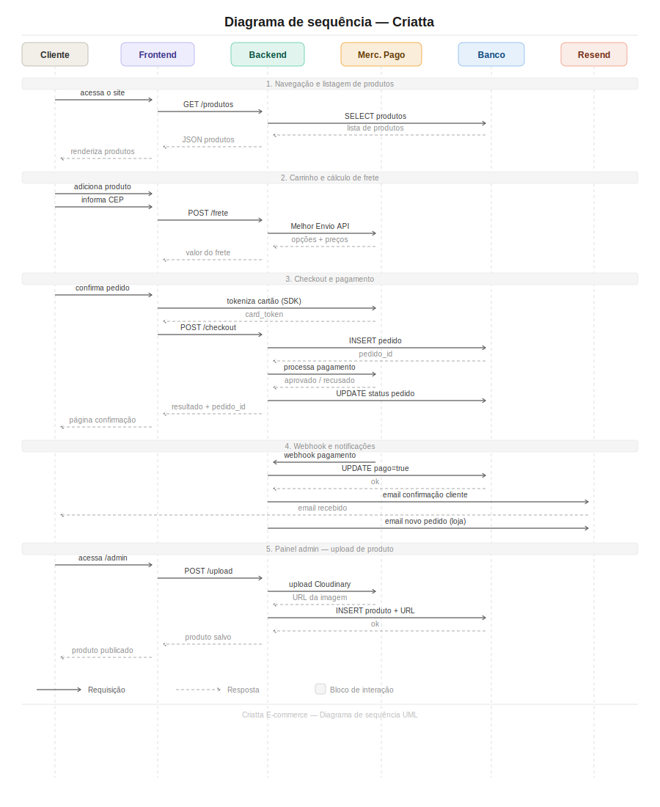

# Relatório Inicial — Criatta E-commerce

**Data de início:** 21/06/2025  
**Desenvolvedor:** Luan  
**Cliente:** Criatta — Produtos Personalizados  
**Repositório:** https://github.com/LuanVs10/criatta

---

## Sobre o projeto

Desenvolvimento de um e-commerce fullstack do zero para a Criatta, loja especializada em produtos personalizados como chaveiros, abridores e brindes.

O site terá catálogo de produtos, carrinho, checkout com Pix e cartão, cálculo de frete, painel administrativo para a cliente gerenciar produtos e pedidos, e notificações por email e WhatsApp.

---

## Identidade visual

| Item | Definição |
|---|---|
| Nome | Criatta |
| Slogan | Pensou, criou, Criatta |
| Cor principal | Dourado `#B8963E` |
| Cor secundária | Cinza `#7A8494` |
| Fundo | Bege `#F5F0EA` |
| Estilo | Minimalista, moderno |
| Logo | Fornecida pela cliente |

---

## Informações da loja

| Item | Definição |
|---|---|
| Produtos | 13 a 14 itens |
| Produção | Sob demanda |
| Frete | Cálculo por CEP + grátis acima R$ 300 |
| Entrega local | Via Uber Flash |
| CEP de origem | 60763-430 |
| Pagamento | Pix e cartão até 3x sem juros |
| Gateway | Mercado Pago |
| Email da loja | usecriatta@proton.me |
| WhatsApp | (85) 98734-2773 |
| Instagram | @criatta |

---

## Stack tecnológica

### Frontend
- Next.js 14 (App Router)
- React + TypeScript
- Tailwind CSS

### Backend
- Node.js
- API Routes (Next.js)
- JWT / NextAuth.js
- Prisma ORM

### Banco de dados
- MySQL / PostgreSQL
- Neon (hospedagem gratuita)

### Hospedagem — 100% gratuita
- Vercel — aplicação
- Cloudinary — fotos e vídeos
- Resend — emails

### Integrações externas
- Mercado Pago — pagamento (Pix + cartão)
- Melhor Envio — cálculo de frete
- WhatsApp — notificações

---

## Sprints planejados

| Sprint | Descrição |
|---|---|
| Pré-sprint | Setup, ambiente e relatório inicial |
| Sprint 1 | Setup e estrutura base |
| Sprint 2 | Páginas públicas — home e produtos |
| Sprint 3 | Autenticação e carrinho |
| Sprint 4 | Checkout, frete e pagamento |
| Sprint 5 | Painel admin |
| Sprint 6 | Notificações, testes e deploy final |
| Sprint 7 | Segurança, performance e testes |

**Estimativa:** ~118h de desenvolvimento  
**Data de conclusão:** a definir

---

## Diagramas UML

### Diagrama de componentes

### Diagrama de sequência
